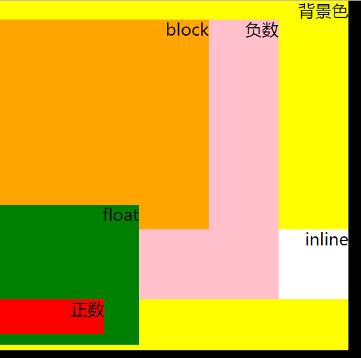

## z-index

### 基础知识

- 支持负值
- 需要和定位元素配合使用，才可以起作用

### 定位

#### 没有发生嵌套

- 后来居上的原则

  ```css
  .box01 {
    position: absolute;
    width: 100px;
    height: 100px;
    background-color: #000;
  }

  .box02 {
    position: absolute;
    width: 100px;
    height: 100px;
    background-color: yellow;
  }
  /* box02 在 box01 上面 */
  ```

  ```html
  <div class="box01"></div>
  <div class="box02"></div>

  ```

- 那个大，那个上

  ```css
  .box01 {
    z-index: 2;
    position: absolute;
    width: 100px;
    height: 100px;
    background-color: #000;
  }

  .box02 {
    z-index: 1;
    position: absolute;
    width: 100px;
    height: 100px;
    background-color: yellow;
  }
  /* box01 在box02上面*/
  ```

#### 定位元素z-index发生嵌套

- 祖先优先原则

  ```html
  <div style="position: relative; z-index: 1">
    <div class="box01" style="z-index: 2"></div>
  </div>
  <div style="position: relative; z-index: 1">
    <div class="box02" style="z-index: 1"></div>
  </div>
  <!--box02 在box01上面  -->
  ```

  ​

### 层叠上下文和层叠水平

#### 层叠上下文

- 表示HTML元素在Z轴的层级
- 底层HTML具有层叠上下文
- z-index为数值的定位元素具有层叠上下文

#### 层叠水平

- 层叠上下文的每个元素都具有一个层叠水平，决定了同一个层叠上下文中元素在z轴上的显示顺序
- 遵循  `后来居上` 和 `谁大谁上` 的层叠原则

#### 特点

- 每一个层叠上下文都是独立的，只需要考虑影响后代元素
- 层叠上下文里面元素层叠顺序不会影响父元素的

### 层叠顺序


```css
/*背景  */
.box {
  font-size: 24px;
  text-align: right;
  position: relative;
  z-index: 1;
  width: 500px;
  height: 500px;
  background-color: yellow;
}

/*z-index:-1  */
.item01 {
  position: absolute;
  width: 400px;
  height: 400px;
  z-index: -1;
  background-color: pink;
}

/*block  */
.item02 {
  width: 300px;
  height: 300px;
  background-color: orange;
}

/*浮动  */
.item03 {
  margin-top: -35px;
  float: left;
  width: 200px;
  height: 200px;
  background-color: green;
}

/*inline  */
.item04 {
  display: inline-block;
  width: 100px;
  height: 100px;
  background-color: #fff;
}

/*正数  */
.item05 {
  position: absolute;
  width: 150px;
  height: 50px;
  background-color: red;
}
```

```html
<div class="box">背景色
  <div class="item01">负数</div>
  <div class="item02">block</div>
  <div class="item03">float</div>
  <div class="item04">inline</div>
  <div class="item05">正数</div>
</div>
```



#### z-index与层叠上下文

- 定位元素的`index` 默认为`auto`  `auto`可以看成0 所以定位元素在普通元素上面
- `z-index`为数值是会创建新的层叠上下文，里面的元素遵循7阶原则
- `z-index`的层叠顺序要看父元素的层叠上下文的顺序