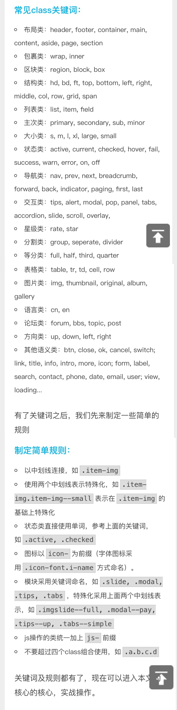

# class命名

### 一、相关资料

- [小米](https://www.mi.com/)
- [腾讯](http://www.qq.com/)
- [BEM](https://www.w3cplus.com/blog/tags/325.html)

腾讯和小米的首页，都是重构的优秀例子


### 二、定义作用域

​	`CSS`的`class`的作用域是全局的，所以通常要通过嵌套，来避免样式冲突，但是优秀的重构，嵌套不能太深，嵌套太深不好维护，通常要控制嵌套在`3-4`层。

**命名方法 BEM**

​	父级的命名采用`BEM `方法命名，` block element modifier` ，分别是块，元素，修饰。

​	通过这种命名方法，定义一个具有意义的父级元素的`class`，最好这个命名是唯一的，在这个网站里，最少在这个页面里。


### 三、子元素命名

#### 基本类名

**布局**

```css
header、footer、container、main、content、aside、page、section
```

**结构类**

```css
hd、bd、ft、top、bottom、left、right、middle、col、row、span、grid、first、last
```

**容器类**

```css
box、item、list、group、cell
```

**包括类**

```css
wrap、inner
```

**大小类**

```css
sub、smail、large、s、m、l
```

**状态类**

```css
active、on、off、warn、error、current、checked、
```


#### 语义化类名

**导航**

```css
nav、prev、next、forward、back、breadcrumb
```

**交互**

```css
tips、alert、pop、tabs、slide、scroll
```

**分割**

```css
sep、line、
```

**表格**

```css
table、tr、td、cell、row
```

**语言**

```css
cn、en
```

**论坛**

```css
forum、bbs、topic、post
```

**评价**

```css
rate、star
```

**常用**

```css
ok、cancel、switch、link、title、info、intro、more、icon、search、contact、phone、date、email、user、view、loading、img、close、btn、mark ...
```

**表单** 

```css
form、label、
```


### 一些规矩

- 父级的模块，通常用一些基础的类名 加特殊语言化单词要定义出来
- 子元素可以直接采用基础类名和语义化类名
- 基础命名必须要在父级作用域下使用


