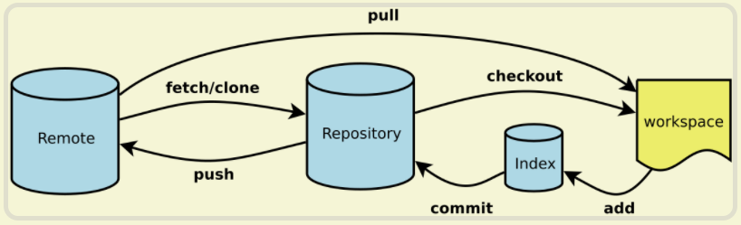

## GIT命令笔记

[GIT命令清单](http://www.ruanyifeng.com/blog/2015/12/git-cheat-sheet.html)

[GIT远程操作详解](http://www.ruanyifeng.com/blog/2014/06/git_remote.html)



- `workspace` 工作区
- `index` 暂存区
- `repository` 本地仓库
- `remote` 远程仓库


### 一、新建代码库

```nginx
# 在当前目录新建一个Git代码库
$ git init

# 新建一个目录，将其初始化为Git代码库
$ git init [project-name]

# 下载一个项目和它的整个代码历史
$ git clone [url]
```


### 二、配置

```nginx
# 设置提交代码时的用户信息
$ git config [--global] user.name "[name]"
$ git config [--global] user.email "[email address]"
```


### 三、增加/删除文件

```nginx
# 添加当前目录的所有文件到暂存区
$ git add .

# 删除工作区文件，并且将这次删除放入暂存区
$ git rm [file1] [file2] ...
```


### 四、代码提交

```nginx
# 提交暂存区到仓库区
$ git commit -m [message]

# 提交时显示所有diff信息
$ git commit -v
```


### 五、查看信息

```nginx
# 显示有变更的文件
$ git status

# 显示当前分支的版本历史
$ git log

# 显示过去5次提交
$ git log -5 --pretty --oneline

# 显示暂存区和工作区的差异
$ git diff
```


### 六、远程同步

```nginx
# origin 为默认远程主机

# 下载远程仓库的所有变动
$ git fetch [remote]

# 显示所有远程仓库
$ git remote -v

# 增加一个新的远程仓库，并命名
$ git remote add [shortname] [url]

# 取回远程仓库的变化，并与本地分支合并，单一分支
$ git pull [remote] [branch]

# 上传本地指定分支到远程仓库 -u为设置默认值
$ git push [-u] [remote] [branch]

# 强行推送当前分支到远程仓库，即使有冲突
$ git push [remote] --force

# 推送所有分支到远程仓库
$ git push [remote] --all
```


### 七、标签

```nginx
# 列出所有tag
$ git tag

# 新建一个tag在当前commit
$ git tag [tag]

# 新建一个tag在指定commit
$ git tag [tag] [commit]

# 删除本地tag
$ git tag -d [tag]

# 删除远程tag
$ git push origin :refs/tags/[tagName]

# 查看tag信息
$ git show [tag]

# 提交指定tag
$ git push [remote] [tag]

# 提交所有tag
$ git push [remote] --tags

# 新建一个分支，指向某个tag
$ git checkout -b [branch] [tag]
```

**建议远程打tag**


### 八、分支

```nginx
# 列出所有本地分支
$ git branch

# 列出所有本地分支和远程分支
$ git branch -a

# 新建一个分支，但依然停留在当前分支
$ git branch [branch-name]

# 新建一个分支，并切换到该分支
$ git checkout -b [branch]

# 切换到指定分支，并更新工作区
$ git checkout [branch-name]

# 合并指定分支到当前分支
$ git merge [branch]

# 合并指定分支到当前分支 并创建记录
$ git merge --no-ff-m[msg] [branch]

# 删除分支
$ git branch -d [branch-name]

# 删除远程分支 两步都要
$ git push origin --delete [branch-name] 
$ git branch -dr [remote/branch]
```

**最好保持 本地分支和远程分支的同步**


### 九、撤销

```nginx
# 恢复暂存区的所有文件到工作区
$ git checkout .

# 重置当前分支的指针为指定commit，同时重置暂存区，但工作区不变 ***
# 用途 撤销无用 commit 但工作区不变，
$ git reset [commit] [HEAD~5]

# 以下两个操作都用比较大的影响，撤销 commit 并且改变工作区
# 重置暂存区与工作区，与上一次commit保持一致
$ git reset --hard

# 重置当前分支的HEAD为指定commit，同时重置暂存区和工作区，与指定commit一致
$ git reset --hard [commit]

# 新建一个commit，用来撤销指定commit ***
# 后者的所有变化都将被前者抵消，并且应用到当前分支
$ git revert [commit]

```


#### 远程仓库SSH设置

**第一步** 

本地电脑生成`SSH` 私钥和公钥

`$ ssh-keygen -t rsa -C "youremail@example.com"`

用户目录有`.ssh`文件，其中`id_rsa` 私钥 和 `id_rsa.pub` 公钥。

**第二步**

在`GITHUB`设置中的`SSH Keys`添加公钥


**特别注意：这个方式只适合SSH的提交，其他协议下载的文件还是需要填写密码来提交的**